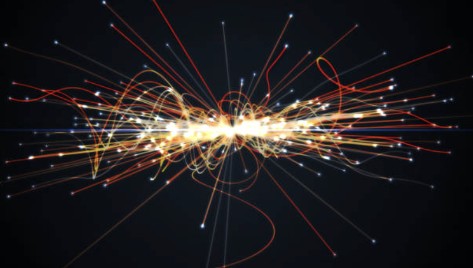

# nova  

**Upcoming · personal project**

**One line:** Graph-aware track reconstruction on CMS Open Data, plus a reproducible low-latency trigger prototype (ONNX → edge GPIO).

---

## Snapshot
A compact, no-fluff repo to experiment with: convert detector hits into graphs, train/validate a GNN that groups hits into charged-particle tracks, add a lightweight anomaly signal, and measure end-to-end inference latency on an edge device.

---

## Core idea (very short)
Use message-passing over hit-graphs to replace/augment combinatorial tracking; export a runnable model for low-latency inference and trigger emulation.

---

## Quick specs
- Input: per-event hits (x,y,z,layer,time,energy) from CERN Open Data (small derived sample)  
- Model: PyTorch / PyG message-passing GNN (edge-classification → connected-components → tracks)  
- Anomaly: track-level autoencoder / simple scoring head  
- Export: ONNX + runtime profiling (desktop + Raspberry Pi)  
- Metrics: tracking efficiency, fake rate, ROC/AUC, inference latency (ms)
